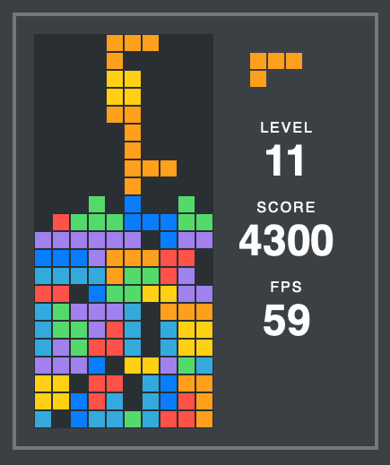

# Tetris in ClojureScript

My personal take on Tetris in ClojureScript.
It’s aimed to be very lightweight, so if you’re interested in a full-powered Tetris in ClojureScript, then better take a look at an amazing project called [t3tr0s](https://github.com/imalooney/t3tr0s).
Otherwise this implementation may still give you an idea of how awesome ClojureScript is and why you will never want to look back at Javascript once you try it.

## Usage

Learn from code or [play it online](http://tetris.temochka.com).

## License

Copyright © 2017-2019 Artem Chistyakov

Distributed under the Eclipse Public License either version 1.0
